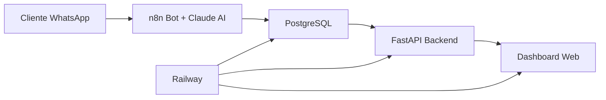

# 🍕 Pizzería Dashboard MVP

> Sistema completo de pedidos por WhatsApp con gestión en tiempo real

[](https://railway.app)
[](https://python.org)
[](https://fastapi.tiangolo.com)
[](https://postgresql.org)

## 🚀 Demo en Vivo

- **Dashboard:** [TU-URL-RAILWAY.up.railway.app](https://tu-url.up.railway.app)
- **API Docs:** [TU-URL-RAILWAY.up.railway.app/docs](https://tu-url.up.railway.app/docs)
- **Health Check:** [TU-URL-RAILWAY.up.railway.app/api/health](https://tu-url.up.railway.app/api/health)

## 🏗️ Arquitectura



## ✨ Características

- 🤖 **Bot conversacional** con IA (Claude API)
- 📱 **WhatsApp Business** integración completa
- 🗄️ **PostgreSQL** base de datos robusta
- ⚡ **FastAPI** backend de alto rendimiento
- 📊 **Dashboard en tiempo real** con auto-refresh
- 🚀 **Deploy automático** en Railway
- 📱 **Responsive design** mobile-first

## 🛠️ Tech Stack

| Componente | Tecnología | Versión |
|------------|------------|---------|
| **Backend** | Python + FastAPI | 3.12+ |
| **Database** | PostgreSQL | 15+ |
| **Frontend** | HTML + CSS + JS | Vanilla |
| **AI** | Claude API | Sonnet |
| **Automation** | n8n | Latest |
| **Deploy** | Railway | Cloud |
| **Messaging** | WhatsApp Business API | v17.0 |

## 🚀 Quick Start

### 1. Clonar Repositorio
```bash
git clone https://github.com/tu-usuario/pizzeria-dashboard-mvp.git
cd pizzeria-dashboard-mvp
```

### 2. Configurar Entorno
```bash
# Crear entorno virtual
python -m venv venv
source venv/bin/activate  # Windows: venv\Scripts\activate

# Instalar dependencias
pip install -r requirements.txt
```

### 3. Variables de Entorno
```bash
# Crear